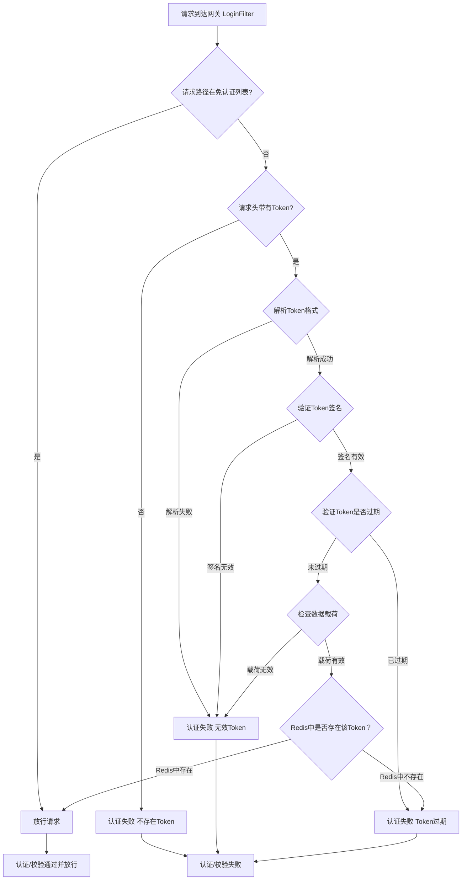

```mermaid
graph TD
    A[请求到达网关 LoginFilter] --> B{请求路径在免认证列表?};
    B -- 是 --> Z[放行请求];
    B -- 否 --> D{请求头带有Token?};
    D -- 否 --> E[认证失败 不存在Token];
    D -- 是 --> F{解析Token格式};
    F -- 解析失败 --> G[认证失败 无效Token];
    F -- 解析成功 --> H{验证Token签名};
    H -- 签名无效 --> G;
    H -- 签名有效 --> I{验证Token是否过期};
    I -- 已过期 --> J[认证失败 Token过期];
    I -- 未过期 --> K{检查数据载荷};
    K -- 载荷无效 --> G;
    K -- 载荷有效 --> L{Redis中是否存在该Token？};
    L -- Redis中不存在 --> J;
    L -- Redis中存在 --> Z;
    Z --> End[认证/校验通过并放行];
    E --> EndFail[认证/校验失败];
    G --> EndFail;
    J --> EndFail;
```
